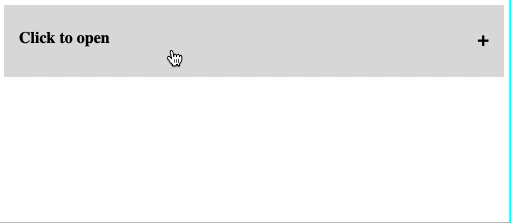
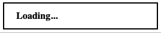
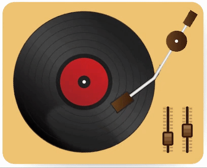

# CSS Animation exercises

This repo contains 4 CSS animation exercises.

They get progressively harder, below is a gif of the inteded outcome of each one:
#### Accordion

#### Modal

#### Loading

#### Vinyl

